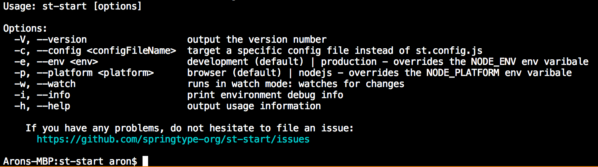

## `st-start`: The missing TypeScript bundler

> Zero configuration TypeScript bundler & DevServer for frontend and Node.js projects.

`st-start` tries to make developing and bundling TypeScript projects so easy, even your cat could do it 😉


While developing SpringType, we've had headaches to find the right go-to bundler for TypeScript.

We thought, it shall be easy, but we've learned that we had to put together a lot of configuration to get where we wanted to be. *And too often, it just broke and we spent half of a day on StackOverflow* :-( 

We just wanted:

- TypeScript: All language features, no namespace issues, fast builds, multi-threaded type checking and dynamic code splitting with `import('...')`
- Modern CSS: PostCSS, LostGrid, CSS modules (with types!) and SASS
- Zero-config! Usually no config file needed. Assumes common sense: Entrypoint: `src/index.tsx?`, `dist` folder for output. `src/index.html` as input HTML.
- Flexible: Everything it assumes should be changable using a config file like `st.config.js`
- Simple configuration: If you need it, just set [easy options](https://github.com/springtype-org/st-start/blob/master/src/interface/ibuild-config.ts) and you get where you want to be
- Robust: Uses webpack + babel but only stable, industry standard plugins. _It shall not break because you let the_ 🐶 _in._
- Efficient: Chooses the best webpack + babel configuration for you (*trust us, we've done tons of painful research on it*). Inlines `<style>` and small images. Tree-shakes and uglifies with `Terser` but keeps class names for sanity. `gzips` all output. *Optional `brotli` compression support.*
- Linting with ESLint and `.eslintrc.js` + auto-fixing code-style issues too
- Backwards compatibility + auto-polyfilling with `.browserslistrc`
- Transparent: It should give a deep insight in what and how it built the code for production (HTML artifact graph analyzer).
- Environment-agnostic: `.env` support and it should replace `process.env.NODE_ENV` and `process.env.ST_*` in frontend code as well. In HTML you should be able to use `%NODE_ENV%` or `%PUBLIC_URL%` to resolve to the right places.
- Developer Experience should be just amazing: Beautiful `console` and  in-browser overlay error messages with code frame highlighting and meaningful stack traces. And desktop notifications for typing errors.
- Versatile: No limitations for frontend frameworks or Node.js as long as they are TypeScript/JavaScript based
- Elegant: It should be fun to read the code as well! :)
- Friendly: This bundler devotes to real-world needs. No paradigms should stand in the way of the  developer.

<h2 align="center">Setup</h2>

    yarn add -D st-start

<h2 align="center">How to use?</h2>

Create or extend the `scripts` entry in your `package.json`:

```json
{
    "scripts": {
        "start:prod": "st-start -env production",
        "start": "st-start"
    },
}
``` 

> Oh, do you already know [the missing npm script runner](https://github.com/springtype-org/st-run)? It can help if you want to run more than one command in npm scripts or run them in parallel. Or run them npx-like. Or run a system command on any platform =)

<h2 align="center">How to customize?</h2>

`st-start` has a few command line parameters. Just run `st-start -h` to learn about them:



You can set CLI arguments like: `st-start -env production` to set the production mode
or set the `platform` to `nodejs` if you like to bundle a Node.js application.

You can also create file `st.config.js` to further specifiy the build configuration.
If this config file name doesn't work for you, you could say `st-start -c my-own-config.js` 
and the bundler would read this config file instead.

<h2 align="center">Easy config file</h2>

It is rather easy to configure rather complex build setups using `st-start`. But sure, we have many options.

That's why we put them together in just two simple  (but long =) files:

- The [IBuildConfig](https://github.com/springtype-org/st-start/blob/master/src/interface/ibuild-config.ts) interface definition
- The [defaults](https://github.com/springtype-org/st-start/blob/master/src/defaults.ts) definition

This way, you can easily find what's important to customize your builds and also know the default behaviour that `st-start` falls back to when you don't set the option.

All documentation is written in the interface definition code too. This makes sure that we never get out-of-sync with documentation and implementation.

Here's an example `st.config.js` for a multi-target build:

```js
module.exports = [{
    // builds a frontend app with an alternative 
    // entryPoint (default would be src/index.tsx or src/index.ts)
    entryPoint: 'src/index-alt.tsx'
}, {
    // this builds a background script, 
    // e.g. for DevTools and bundles it all into one single file
    entryPoint: 'src/background.ts',
    singleFileOutput: 'dist/background.js'
}, {
    // here we bundle a Node.js application
    isNodeJsTarget: true,
    entryPoint: 'src/server.ts',
    singleFileOutput: 'dist/server.js'
}];
```

As you can see, we've put great effort in naming the options intuitively. 

The context path (the directory `st-start` operates in) is always the directory you start `st-start` in.

So all paths you name in the config should be either absolute paths or relative to the context path.

<h2 align="center">A note on Node.js</h2>

Node.js doesn't usually know how to handle Source Maps. 

So when you bundle a server application using `st-start`,
and there is an error or you want to debug it, it's better to tell node to show you the original code instead of the optimzed, transpiled one.

For that, just install:

    yarn add -D source-map-support

And run `node` like this:

    node -r source-map-support/register dist/yourNodeScript.js

<h2 align="center">Build and Test</h2>

Especially if you contributed to this project, you'd like to build and test it to make sure everything works fine, before you open a Pull Request (PR) :-)

So in a shell, please run:

    # install the dependencies
    yarn

    # transpile the code, copy files over to ./dist
    yarn build

    # run unit & end-to-end tests
    yarn test


<h2 align="center">Our Motivation</h2>

You may ask: *"Why do we need another bundler?"* We've asked us the same question. 

We really didn't wanted to develop `st-start`. It was a lot of work and it wasn't fun all the time. However, we felt like we had no other choice. Why?

`TL;DR:`

*We wanted an easy to use TypeScript bundler that could do everything `create-react-app` could do and on top of that a little bit more. We wanted this bundler to be framework agnostic: But there was none*.

We've tried many different solutions over the course of one year of framework development: 
- webpack/babel custom config per project
- create-react-app
- Parcel
- Rollup 
- FuseBox

...but, no matter the amazing features, the amazing teams and amazing solutions they hard, when it came to our needs, they all had limitations that eventually clashed with some paradigms and it led to one or more limitations that we couldn't overcome:

- Complexity in configuration
- Inflexibility in zero-configuration setups
- Fragility in less usual setups
- Platform-dependence
- Framework-dependence

We needed a solution for the users of SpringType, which is just easy ot use and *just works fine in all cases*. SpringType uses TypeScript primarily and there was no TypeScript-first bundler that would give us, what we wanted.

The compromise was to develop a simple to use, multi-target TypeScript build system that would use industry standard projects and glue them together in a smart way and so, `st-start` was born.

However, this is not the end of the story. *We have big plans! :-)*

<h2 align="center">Our Vision</h2>

At the time being, this project is what we have and it works really well. However, we're less happy with the 
transpilation performance. Parsing, type-checking and transpiling TypeScript takes a toll on performance atm.

So we came to the conclusion that at one time in the future we want to come up with a new transpiler architecture
and replace babel and webpack.

However, the configuration API will remain the same because the interface is designed agnostic to the implementations used *and we love API stability.*


<h2 align="center">Short-term Roadmap</h2>

We're keen to improve this implementation until we feel really comfortable with it. Right now this lacks:

- [ ] Many e2e tests
- [ ] Almost all unit tests
- [ ] A refactoring towards a more modular, functional code base. We want smaller functions which are better to test and a better domain-driven grouping of features
- [ ] Some defaults are still hard-coded and should become config options
- [ ] We need your input about what to improve next. Please file an issue if you find something counter-intuitive or buggy.

<h2 align="center">Maintainers</h2>

<table>
  <tbody>
    <tr>
      <td align="center">
        
        </br>
        <a href="https://github.com/kyr0">Aron Homberg</a>
      </td>
      <td align="center">
        
        </br>
        <a href="https://github.com/mansi1">Michael Mannseicher</a>
      </td>
    </tr>
  <tbody>
</table>

<h2 align="center">Contributing</h2>

Please help out to make this project even better and see your name added to the list of our  
[CONTRIBUTORS.md](./CONTRIBUTORS.md) :tada: